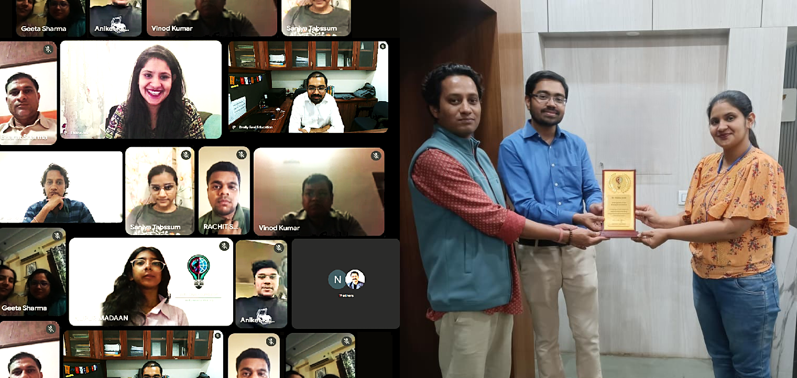

# 🧠 Nurolab  
*Smart Mental Health Monitoring using EEG & AI*

---

## 📸 Awareness & Outreach

---

## 🌍 Overview
**Nurolab** is an interdisciplinary initiative focused on building **smart systems to monitor, understand, and improve mental health** using **EEG (Electroencephalography) and Artificial Intelligence**.

The project combines:
- 🧠 Neuroscience  
- 🤖 AI & Machine Learning  
- 🛠️ Hardware Product Design  

Our goal is to move from **subjective mental health assessment → objective, data-driven insights**.

---

## 🚨 Problem Statement
Mental health issues are:
- Often **invisible and subjective**
- Diagnosed based on **self-reporting**
- Lacking **continuous monitoring tools**

This leads to:
- Delayed diagnosis  
- Inconsistent treatment  
- Poor real-time intervention  

---

## 💡 Our Approach
We aim to develop a system that:
1. **Measures brain activity using EEG**
2. **Analyzes patterns using AI models**
3. **Detects mental states (stress, anxiety, focus, etc.)**
4. **Provides actionable insights or interventions**

---

## 🧠 Why EEG?
EEG enables:
- Real-time brain signal capture  
- Non-invasive monitoring  
- Detection of cognitive and emotional patterns  

We aim to extract meaningful features like:
- Alpha, Beta, Theta waves  
- Signal coherence  
- Brain activity patterns linked to mental states  

---

## 🤖 AI Component
The system leverages:
- Machine Learning for pattern recognition  
- Deep Learning for signal interpretation  
- Predictive models for early detection  

Potential outputs:
- Stress level estimation  
- Cognitive load tracking  
- Emotional state prediction  

---

## 🛠️ System Architecture

### 1. Hardware Layer
- EEG sensors (wearable device)
- Signal acquisition system

### 2. Data Processing Layer
- Noise filtering  
- Signal preprocessing  
- Feature extraction  

### 3. AI Layer
- Classification models  
- Pattern recognition  
- Predictive analytics  

### 4. Application Layer
- User dashboard  
- Alerts & insights  
- Mental wellness recommendations  

---

## 🎯 Objectives
- Build a **low-cost EEG-based mental health device**
- Develop **AI models for mental state detection**
- Create a **user-friendly monitoring platform**
- Enable **early intervention and self-awareness**

---

## 🌱 Potential Impact
- 📊 Objective mental health tracking  
- 🧘 Personalized wellness insights  
- 🏥 Support for clinicians and therapists  
- 🌍 Scalable mental health solutions  

---

## ⚠️ Challenges
- EEG signal noise and variability  
- Need for large, high-quality datasets  
- Ethical concerns (privacy, data security)  
- Clinical validation requirements  

---

## 🔬 Future Scope
- Integration with wearable devices  
- Real-time intervention systems  
- Personalized AI mental health assistants  
- Collaboration with healthcare institutions  

---

## 🤝 Contribute
We welcome:
- AI/ML researchers  
- Neuroscience enthusiasts  
- Hardware developers  
- Mental health professionals  

---

## 🌟 Vision
> “Making mental health measurable, understandable, and improvable through technology.”