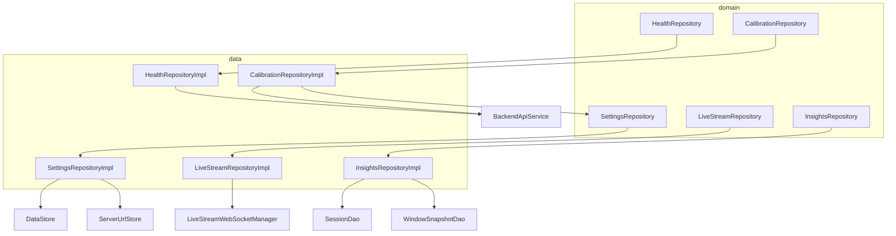
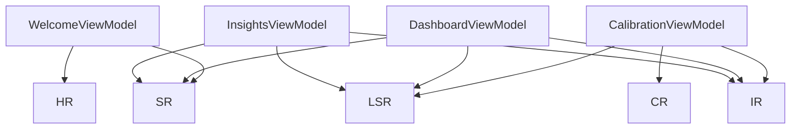
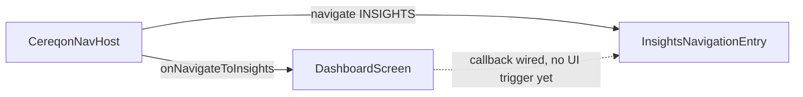
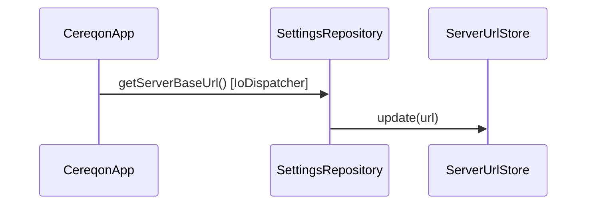

# Cereqon Android — Dependency Graph

## Hilt component tree

```
@SingletonComponent
├── NetworkModule
├── DatabaseModule
├── RepositoryModule (@Binds)
├── CoroutineModule
└── @Inject constructors (LiveStreamWebSocketManager, ServerUrlStore, …)
```

Installed in: `CereqonApp` (`@HiltAndroidApp`)

## Module details

### `NetworkModule` (`di/AppModule.kt`)

| Provides | Dependencies |
|----------|--------------|
| `Json` | — |
| `HttpLoggingInterceptor` | — |
| `OkHttpClient` | `DynamicBaseUrlInterceptor`, `HttpLoggingInterceptor` |
| `Retrofit` | `OkHttpClient`, `Json`, `ServerUrlStore` |
| `BackendApiService` | `Retrofit` |

### `DatabaseModule` (`di/AppModule.kt`)

| Provides | Dependencies |
|----------|--------------|
| `CereqonDatabase` | `@ApplicationContext` |
| `SessionDao` | `CereqonDatabase` |
| `WindowSnapshotDao` | `CereqonDatabase` |
| `CalibrationAttemptDao` | `CereqonDatabase` |
| `ReportDao` | `CereqonDatabase` |

### `RepositoryModule` (`di/AppModule.kt`)

| @Binds | Implementation |
|--------|----------------|
| `HealthRepository` | `HealthRepositoryImpl` |
| `CalibrationRepository` | `CalibrationRepositoryImpl` |
| `LiveStreamRepository` | `LiveStreamRepositoryImpl` |
| `SettingsRepository` | `SettingsRepositoryImpl` |
| `InsightsRepository` | `InsightsRepositoryImpl` |

### `CoroutineModule` (`di/CoroutineModule.kt`)

| Provides | Qualifier |
|----------|-----------|
| `CoroutineDispatcher` | `@IoDispatcher` |
| `CoroutineDispatcher` | `@DefaultDispatcher` |
| `CoroutineScope` | `@ApplicationScope` + `@Singleton` |

## Repository dependency graph



### InsightsRepository reactive surface (P0)

| Method | Type | Backing DAO query |
|--------|------|-------------------|
| `observeActiveSession()` | `Flow<InsightSession?>` | `SessionDao.observeActiveSession()` |
| `observeWindowSnapshots(id)` | `Flow<List<InsightWindowSnapshot>>` | `WindowSnapshotDao.observeBySession()` |
| `observeWindowSnapshotCount(id)` | `Flow<Int>` | `WindowSnapshotDao.observeCountBySession()` |
| `startSession` / `endSession` / `recordWindowSnapshot` | `suspend` | Write-through (Dashboard, Calibration) |

Suspend read methods (`getActiveSession`, `getWindowSnapshots`, etc.) remain for internal write-path guards.

## ViewModel dependency graph



### WebSocket access by ViewModel

| ViewModel | `LiveStreamRepository` usage |
|-----------|------------------------------|
| `DashboardViewModel` | Owner — `start()`, `stop()`, `windows`, `connectionState`, `reconnectAttemptCount` |
| `CalibrationViewModel` | Owner — `start()`, `stop()`, `windows`, `connectionState` |
| `InsightsViewModel` | Read-only — `connectionState` observe only |

## WebSocket manager internals

```mermaid
graph LR
    WSM[LiveStreamWebSocketManager]
    WSM --> OK[OkHttpClient]
    WSM --> JSON[Json]
    WSM --> SUS[ServerUrlStore]
    WSM --> AS[@ApplicationScope]
```

`LiveStreamWebSocketManager` is `@Singleton @Inject` — not explicitly provided in a module.

## Navigation dependency graph (P0)



## URL synchronization chain

```
SettingsRepositoryImpl
    │ read/write
    ▼
DataStore (server_base_url)
    │ sync on every get/set
    ▼
ServerUrlStore
    ├──▶ DynamicBaseUrlInterceptor (Retrofit)
    ├──▶ Retrofit baseUrl
    └──▶ LiveStreamWebSocketManager (WS URL build)
```

## Application startup



Ensures network components have the persisted URL before first request.

## Scoping summary

| Type | Scope | Lifetime |
|------|-------|----------|
| Repositories | `@Singleton` | Application |
| `CereqonDatabase` | `@Singleton` | Application |
| `LiveStreamWebSocketManager` | `@Singleton` | Application |
| ViewModels | `@HiltViewModel` | ViewModelStore (per destination) |
| `DashboardTimelineHistory` | ViewModel state | ViewModel lifetime |
| Health cache | `@Volatile` in impl | Application |
| Room Flow observers | ViewModel coroutine | Cancelled on `onCleared` |

## Unused DI wiring (available for future phases)

| DAO | Provided | Consumed by |
|-----|----------|-------------|
| `CalibrationAttemptDao` | Yes | Nothing yet |
| `ReportDao` | Yes | Nothing yet |

## Adding a new feature (pattern)

1. Define `domain/repository/XxxRepository.kt`
2. Implement `data/repository/XxxRepositoryImpl.kt` with `@Singleton @Inject`
3. Add `@Binds` in `RepositoryModule`
4. Create `presentation/xxx/XxxViewModel.kt` with `@HiltViewModel`
5. Add route to `Routes.kt` and `CereqonNavHost.kt`

Insights (Phase 5A) followed this pattern exactly.
