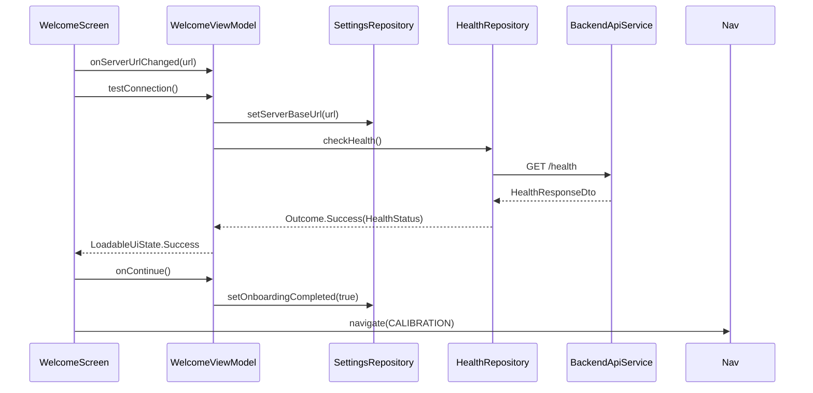
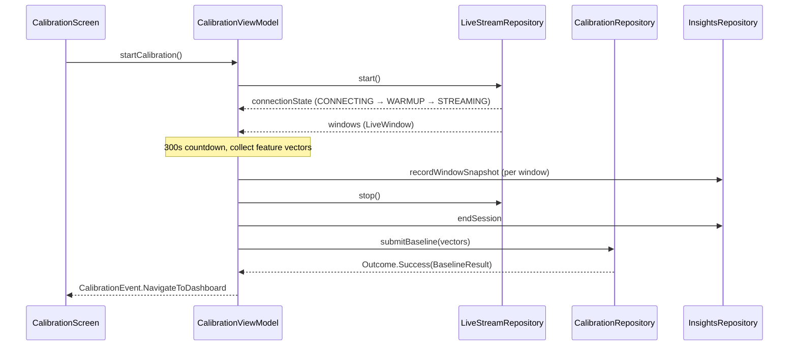
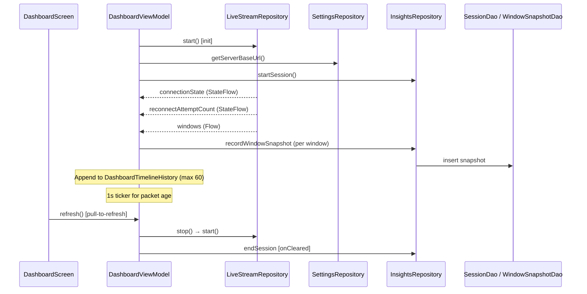
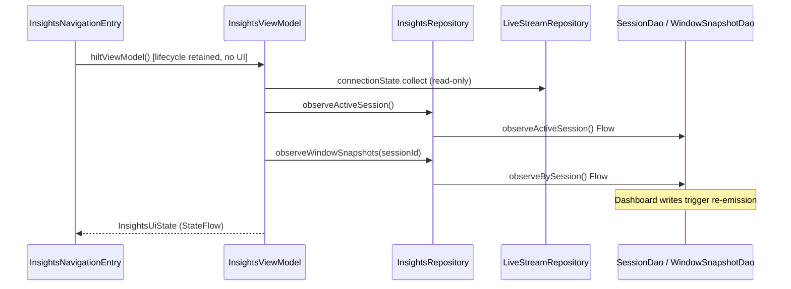

# Cereqon Android — Application Flow

## Onboarding flow (current)

```
Welcome ──health OK──▶ Calibration ──baseline OK──▶ Dashboard
                                                      │
                                                      └── Settings (gear only; Insights/Reports not linked from UI)
```

Navigation uses `popUpTo { inclusive = true }` so the user cannot navigate back to completed onboarding steps.

| Step | Route | Trigger | Outcome |
|------|-------|---------|---------|
| 1 | `welcome` | App launch (`startDestination`) | User enters server URL, tests `GET /health` |
| 2 | `calibration` | Continue after successful health check | 5-minute live stream collection → `POST /calibration/build_baseline` |
| 3 | `dashboard` | Baseline upload success | Live WebSocket dashboard; persists windows to Room |
| 4 | `insights` | *(not reachable from UI)* | Route registered; `InsightsNavigationEntry` has no screen composables |
| 5 | `reports` | *(not reachable from UI)* | Route registered; list UI only, no export actions wired |

**Note:** `startDestination` is always `Routes.WELCOME`. Onboarding-completion routing (skip Welcome when already set up) is not yet implemented.

## Welcome flow



## Calibration flow



**Stream states during calibration:** `CONNECTING` → `WARMUP` (~20 s server warmup) → `STREAMING` → collection → `stop()`.

## Dashboard flow



Dashboard **owns** the WebSocket stream and **writes** window snapshots to Room. Chart timeline (`DashboardTimelineHistory`) remains in-memory only.

## Insights flow (Phase 5A — architecture only)



**Insights route:** `Routes.INSIGHTS` is registered in `CereqonNavHost` but **Dashboard has no button** that calls `onNavigateToInsights` (callback exists, parameter is unused). No visual composables on the Insights screen yet.

**Read path:** reactive Room `Flow` — no one-shot cache loads.  
**Write path:** owned by Dashboard and Calibration; Insights never writes.

## Live stream connection lifecycle

```
DISCONNECTED
    │ start()  [Dashboard or Calibration only]
    ▼
CONNECTING ──WebSocket open──▶ WARMUP ──first payload──▶ STREAMING
    │                              │                        │
    │                              │                        │ connection lost
    │                              │                        ▼
    │                              │                   RECONNECTING
    │                              │                   (exponential backoff)
    │                              │                        │
    │                              └─────── failed ────────▶ FAILED
    │
    └── stop() ──▶ DISCONNECTED
```

Managed by `LiveStreamWebSocketManager` (singleton, `@ApplicationScope`).

### Stream ownership summary

| Caller | `start()` | `stop()` | `windows.collect` | `connectionState` observe |
|--------|-----------|----------|---------------------|---------------------------|
| DashboardViewModel | Yes | Yes (`onCleared`) | Yes | Yes |
| CalibrationViewModel | Yes | Yes | Yes | Yes |
| InsightsViewModel | **No** | **No** | **No** | Yes (offline semantics) |

## Offline / cache semantics (Insights)

| Stream state | Cached Room data | `OfflineUiState` |
|--------------|------------------|------------------|
| STREAMING, WARMUP, CONNECTING, RECONNECTING | any | `Online` |
| DISCONNECTED, FAILED | session or snapshots exist | `OfflineWithCache(lastCachedAtEpochMs)` |
| DISCONNECTED, FAILED | none | `OfflineNoCache` |

Room observers keep `InsightsUiState` current while Dashboard writes snapshots; no manual refresh required.
